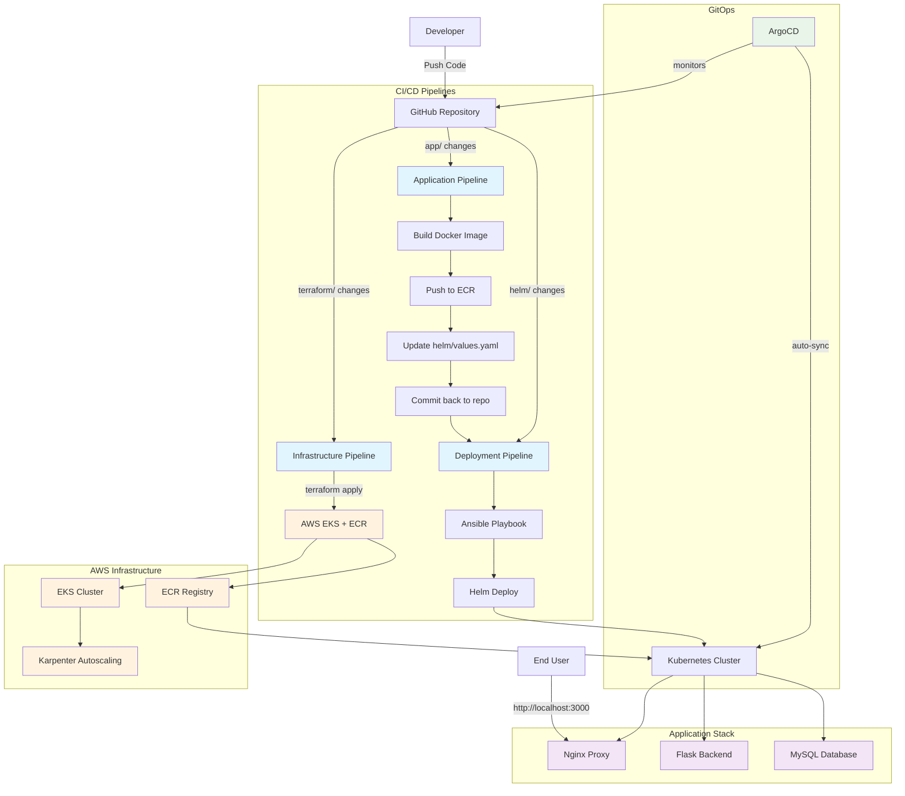

# Notes App CI/CD Architecture Diagram

## Workflow Triggers

1. **Infrastructure Pipeline**: `terraform/` changes → EKS cluster setup
2. **Application Pipeline**: `app/` changes → Docker build → ECR push → values update
3. **Deployment Pipeline**: `helm/values.yaml` changes → Ansible → Helm deploy
4. **GitOps Pipeline**: ArgoCD continuous monitoring → auto-sync to K8s

## Key Components

- **GitHub Actions**: Orchestrates all CI/CD pipelines
- **Terraform**: Infrastructure as Code for AWS resources
- **Ansible**: Deployment automation and orchestration
- **Helm**: Kubernetes package management
- **ArgoCD**: GitOps continuous deployment
- **Karpenter**: Node autoscaling for EKS cluster
